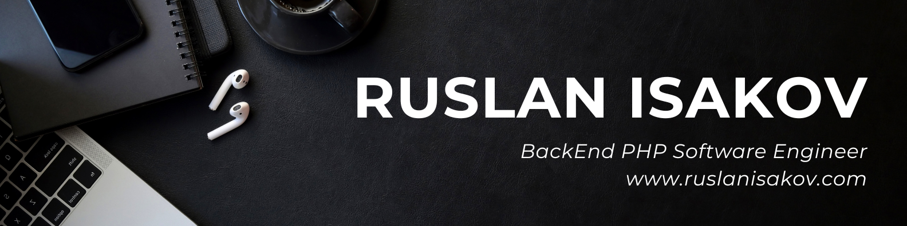

# 👋 Hello! My name is Ruslan Isakov
Senior Software Engineer with more than 6+ years of commercial development experience using various modern technologies. I have deep knowledge of the Laravel and Symfony frameworks. I adhere to the principles of Clean Code, SOLID, DRY, KISS, YAGNI, and also apply development methods such as TDD and DDD principles. I have a higher education in software engineering. 

I have public speaking and public speaking skills, which allows me to interact more successfully with colleagues and clients. I am a purposeful, energetic and conscientious person, constantly striving for professional and personal development. For me, “continuous learning is the key to success”! 
I have been trained in many international organizations, such as: IUC, KECB, FoxmindEd, etc

#### 🔗 More detailed information about skills and work experience can be found here:
* 💼 <a href="https://ruslanisakov.com/projects" target="_blank">Portfolio of Works</a>
* 🖥 <a href="https://www.linkedin.com/in/ruslanisakovcom" target="_blank">Linkedin</a> 
* 📄 <a href="https://ruslanisakov.com/files/Ruslan_Isakov_CV_PHP_Laravel_Symfony_RU.pdf" target="_blank">CV (RU version)</a> 
