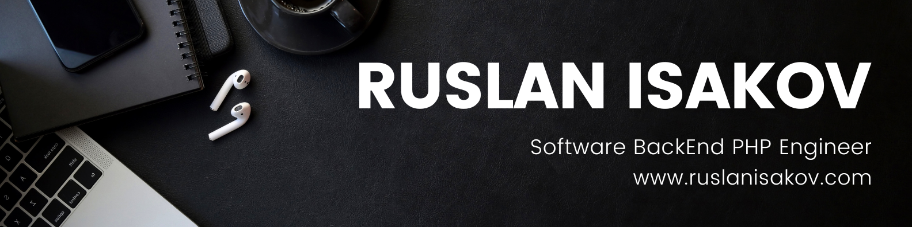

# 👋 Hello! My name is Ruslan Isakov
Experienced Senior Software Engineer with 5+ years of experience in software development in PHP 8 and PHP 7 using various technologies, databases. I have deep knowledge of the Laravel and Symfony frameworks. I adhere to the principles of SOLID, DDD, TDD, DRY, KISS and YAGNI.

#### 🖥 Hard Skills:
* PHP (Laravel, Symfony), ООП, MVC
* CleanCode, SOLID, DRY, KISS, YAGNI
* Docker, RESTful API, Swagger
* Git, github, CI/CD, Linux
* MySQL, MS SQL, PostgreSQL
* HTML, CSS, Bootstrap, JS (Ajax, jQuery), Adaptive layout
* PhotoShop, illustrator, AfterEffects

#### 🏆 Soft Skills:
* Determination
* Learning ability
* Oratory/Public Speaking
* Time management and planning
* Emotional intellect
* Project management
* Customer focus
* Making decisions
* Self-reflection
* Critical thinking
* Working in uncertainty mode

#### 💼 Projects: https://ruslanisakov.com/projects
#### 📄 Resume: https://ruslanisakov.com/files/Ruslan_Isakov_CV_PHP_Laravel_Symfony.pdf
