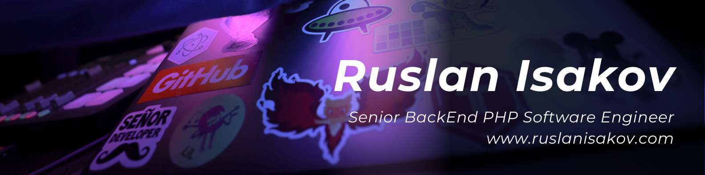

# 👋 Hello! My name is Ruslan Isakov
<strong><code>Senior/TeamLead BackEnd PHP Software Engineer</code></strong> with more than 7+ years of commercial development experience using various modern technologies. I have a higher education in software engineering. I have a higher education in software engineering and international official certifications confirming my level of expertise. I have deep knowledge of the Laravel and Symfony frameworks. I adhere to the principles of Clean Code, SOLID, DRY, KISS, YAGNI, and also apply development methods such as TDD and DDD principles. 

I have public speaking and public speaking skills, which allows me to interact more successfully with colleagues and clients. I am a goal-oriented, responsible and strong-willed person, striving for professional and personal development. I believe that "continuous learning is the key to success".
I have been trained in many international organizations, such as: Laravel, Symfony, IUC, KECB, FoxmindEd, etc

In my free time, I try to live an active and fulfilling life: I enjoy sports, travel and find time to meet with friends to maintain a balance between work and life.
  

## More detailed information about skills and work experience can be found here:

